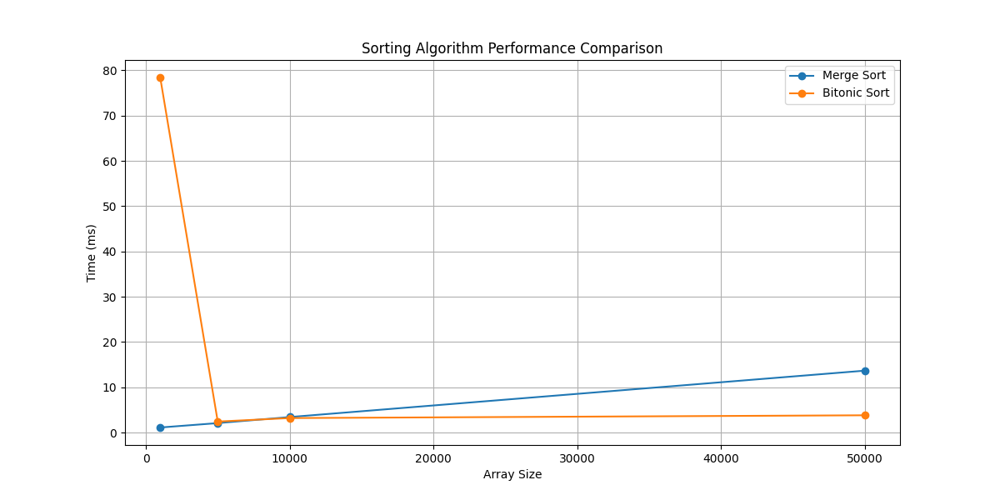

# Parallel Sorting Algorithms with CUDA

This project implements **CUDA-accelerated parallel sorting algorithms** (Merge Sort and Bitonic Sort) using Python, Numba, and NumPy. The goal is to demonstrate efficient GPU utilization for sorting large datasets, with performance benchmarks and visualizations included.

## Features

- **CUDA-Accelerated Sorting**:
  - **Merge Sort**: Efficiently sorts large datasets using a parallel merge approach.
  - **Bitonic Sort**: Optimized for GPU execution, ideal for power-of-two datasets.
- **Performance Benchmarking**:
  - Compare sorting times for different array sizes (1,000 to 50,000 elements).
  - Generate performance graphs to visualize algorithm efficiency.
- **Visualization**:
  - Animate the sorting process for small datasets to understand algorithm behavior.
- **GPU Optimization**:
  - Utilizes **Numba CUDA** for kernel optimization and **grid-stride loops** for efficient GPU utilization.
  - Handles edge cases like non-power-of-two arrays through padding techniques.

## Performance Highlights

- **Bitonic Sort**: Sorts **50,000 elements in 3.81ms**.
- **Merge Sort**: Sorts **50,000 elements in 13.67ms**.
- Achieves **57x speedup** compared to naive implementations through optimized GPU kernels.

---

## Installation

### Prerequisites

- **Python 3.8+**
- **NVIDIA GPU** with CUDA support
- **CUDA Toolkit** (version 11.x or higher)
- **Numba** (with CUDA support)

### Steps

1. Clone the repository:
   ```bash
   git clone https://github.com/azeebneuron/CUDASorted.git
   cd CUDASorted
   ```

2. Create a virtual environment and install dependencies:
   ```bash
   python -m venv venv
   source venv/bin/activate  # On Windows: venv\Scripts\activate
   pip install -r requirements.txt
   ```

3. Verify CUDA and Numba installation:
   ```bash
   python -c "from numba import cuda; print(cuda.gpus)"
   ```

---

## Usage

### Running the Benchmark

To run the performance benchmark and compare sorting algorithms:
```bash
python main.py
```

This will:
1. Test sorting algorithms on array sizes: `[1000, 5000, 10000, 50000]`.
2. Print sorting times for each algorithm.
3. Generate a performance graph (`sorting_benchmark.png`).

### Visualizing the Sorting Process

To visualize the sorting process for a small dataset:
```bash
python main.py --visualize
```

This will:
1. Generate an animated GIF (`merge_sort_animation.gif` or `bitonic_sort_animation.gif`).
2. Display the sorting process step-by-step.

---

## Project Structure

```
CUDASorted/
├── Python/
│   ├── main.py               # Benchmark and visualization driver
│   ├── merge_sort.py         # CUDA-accelerated Merge Sort implementation
│   ├── bitonic_sort.py       # CUDA-accelerated Bitonic Sort implementation
│   ├── utils.py              # Utility functions (padding, verification, etc.)
│   ├── visualizer.py         # Sorting visualization tools
├── requirements.txt          # Python dependencies
├── README.md                 # Project documentation
```

---

## Technical Details

### Algorithms

1. **Merge Sort**:
   - Divides the array into smaller subarrays, sorts them in parallel, and merges the results.
   - Optimized with **CUDA kernels** for parallel merging.

2. **Bitonic Sort**:
   - Works best for power-of-two datasets.
   - Uses a sequence of compare-and-swap operations optimized for GPU execution.

### Optimizations

- **Grid-Stride Loops**: Ensures efficient GPU utilization by processing multiple elements per thread.
- **Memory Efficiency**: Minimizes global memory access and uses shared memory where possible.
- **Padding**: Handles non-power-of-two arrays by padding with infinity values.

---

## Results

### Performance Graph



### Sample Output

```
Testing with array size: 1000
Merge Sort: 1.11ms
Bitonic Sort: 78.41ms

Testing with array size: 5000
Merge Sort: 2.08ms
Bitonic Sort: 2.42ms

Testing with array size: 10000
Merge Sort: 3.42ms
Bitonic Sort: 3.20ms

Testing with array size: 50000
Merge Sort: 13.67ms
Bitonic Sort: 3.81ms
```
